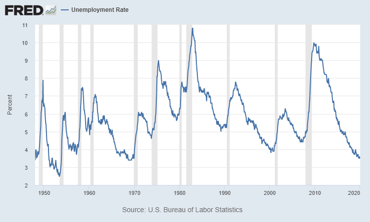
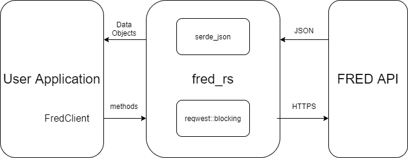

# fred-rs

 **fred-rs is a simple interface for accessing the Federal Reserve Bank of St. Louis's FRED API.**

 ---
 ```toml
 [dependencies]
 fred_rs = "0.1.0"
 ```

 ## Useful Links
<b>fred-rs</b> Docs <br>
[FRED API Documentaion](https://research.stlouisfed.org/docs/api/fred/#General_Documentation) <br>
[FRED API Key Information](https://research.stlouisfed.org/docs/api/api_key.html)

<hr>

## FRED (Federal Reserve Economic Data)

 FRED is a large online database of economic data hosted by the Federal Reserve Bank of St. Louis.  The website currently hosts approximately "672,000 US and international time series from 89 sources" including the the graph of unemployment rate shown below.

<p align="center"> 

<br>
<sup>
U.S. Bureau of Labor Statistics, Unemployment Rate [UNRATE], retrieved from FRED, Federal Reserve Bank of St. Louis; https://fred.stlouisfed.org/series/UNRATE, February 20, 2020.
<sup/>
</p>

Access to the raw data is available through the FRED API.  <b>fred-rs</b> is an intermediate layer between the HTTPS client and the user application.  Requests to the FRED API are made through structured calls to the fred_rs FredClient and data is returned as usable data objects (structs).

## fred-rs Overview
<b>fred-rs</b> acts as a middleman to facilitate requests to the FRED API.  The user application
creates and manages a `FredClient`, which manages the HTTPS client and parses incoming data.  Currently 
the client uses the reqwest::blocking::client, but if there exists a need for an
async version then that can be explored.  The diagram below shows the general architecture 
from an application standpoint.

<p align="center"> 

</p>

## Usage
Below is an example of the general usage for accessing an observation or data series.

```rust
use fred_rs::client::FredClient;
use fred_rs::series::observation::{Builder, Units, Frequency, Response};

// Create the client object
let mut c = match FredClient::new() {
    Ok(c) => c,
    Err(msg) => {
        println!("{}", msg);
        return
    },
};

// Create the argument builder
let mut builder = Builder::new();

// Set the arguments for the builder
builder
    .observation_start("2000-01-01")
    .units(Units::PCH)
    .frequency(Frequency::M);

// Make the request and pass in the builder to apply the arguments
let resp: Response = match c.series_observation("GNPCA", Some(builder)) {
    Ok(resp) => resp,
    Err(msg) => {
        println!("{}", msg);
        return
    },
};
```

#### Request Parameters
All endpoints use the builder approach to construct the API URL.  Each builder 
method corresponds to a paramter that can be added to the API request. 

In the example above, three parameters are added to the request, observation_start, units and frequency.
The [FRED API Documentation](https://research.stlouisfed.org/docs/api/fred/#General_Documentation) 
explains the possible parameters for each endpoint.  Required paramters (except the `tag_names` paramter) are
passed to the client function itself.  In the example, series_id is a required paramter and is passed 
directly to the client function as `"GNPCA"`.  The `tag_names` parameter available on some endpoints 
accepts a list of arguments, so it is easier to pass this argument to the builder.

## API Key
Developers need to request an API Key in order to access FRED.  This can be done 
at [https://research.stlouisfed.org/docs/api/api_key.html](https://research.stlouisfed.org/docs/api/api_key.html).

<b>fred-rs</b> looks for the `FRED_API_KEY` environment variable by default.  The 
variable can be set with the following line in Bash.
```bash
export FRED_API_KEY=abcdefghijklmnopqrstuvwxyz123456
```

Alternatively, the `FredClient.with_key()` function allows the key to be set from a string reference.
```rust
use fred_rs::client::FredClient;

let mut client = match FredClient::new() {
    Ok(c) => c,
    Err(msg) => {
        println!("{}", msg);
        return
    },
};

client.with_key("abcdefghijklmnopqrstuvwxyz123456");
```

## Issues/Bugs/Improvments/Help/Questions
If you discover any issues or bugs, want to suggest any improvements, or have 
questions about the crate, feel free to open a GitHub issue or email me directly 
at matthewdsabo@gmail.com with <b>fred-rs</b> in the subject line.

#### License

<sup>
Licensed under either of <a href="LICENSE-APACHE">Apache License, Version
2.0</a> or <a href="LICENSE-MIT">MIT license</a> at your option.
</sup>

<br>

<sub>
Unless you explicitly state otherwise, any contribution intentionally submitted
for inclusion in this crate by you, as defined in the Apache-2.0 license, shall
be dual licensed as above, without any additional terms or conditions.
</sub>
